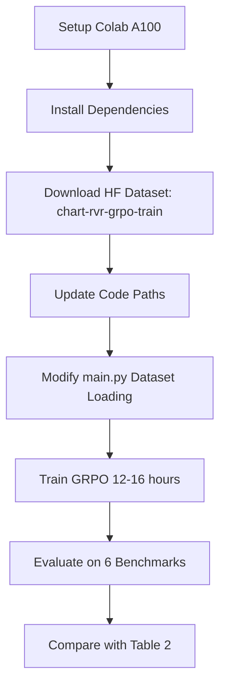
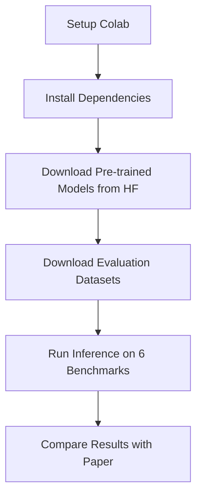

# Chart-RVR Reproduction Guide

> **Goal**: Reproduce the Chart-RVR GRPO training results from the paper using the official codebase and pre-generated HuggingFace dataset.

---

## 🎯 Quick Navigation

- **Just want to train GRPO?** → Jump to [GRPO Training Workflow](#grpo-training-complete-workflow)
- **Confused about datasets?** → Read [Dataset Confusion Explained](#understanding-the-dataset-confusion)
- **Need hardware info?** → Check [Hardware Requirements](#hardware-requirements--where-to-run-what)

---

## Table of Contents
1. [Hardware Requirements & Where to Run What](#hardware-requirements--where-to-run-what)
2. [Environment Setup](#environment-setup)
3. [Dataset Preparation](#dataset-preparation)
4. [Understanding the Dataset Confusion](#understanding-the-dataset-confusion)
5. [Training Models](#training-models)
6. [Evaluation](#evaluation)
7. [Troubleshooting](#troubleshooting)

---

## ⚡ Key Facts You Need to Know

### ❓ Do I need to run SFT before GRPO?
**NO!** GRPO training starts directly from the base Qwen2.5-VL-3B model. SFT is only a baseline for comparison in the paper.

### ❓ Do I need to generate the dataset with the 72B model?
**NO!** The authors provide a pre-generated dataset on HuggingFace with all rationales already included.

### ❓ What dataset should I use for training?
**`sanchit97/chart-rvr-grpo-train`** - This is a 34.2k sample dataset with:
- ✅ Images from ChartQA, PlotQA, ChartFC
- ✅ Chain-of-thought rationales (already generated!)
- ✅ Chart types labeled
- ✅ Tables reconstructed in JSON format

### ❓ What does `--dataset-name chartqa-src` mean?
**It's misleading!** For GRPO training, this argument is mostly **ignored**. The actual training data is loaded from the HuggingFace dataset. This argument is only used for evaluation dataset selection.

---

## Hardware Requirements & Where to Run What

### Your Hardware
- **Local**: RTX 4060 (8GB VRAM)
- **Colab**: A100 (40GB VRAM)

### What Runs Where

| Task | VRAM Required | Local (8GB) | Colab (40GB) | Notes |
|------|--------------|-------------|--------------|-------|
| **Dataset Download** | Minimal | ✅ | ✅ | Just downloads, no GPU needed |
| **Evaluation (Inference)** | ~8-10GB | ⚠️ Tight fit | ✅ Recommended | Qwen2.5-VL-3B + batch processing |
| **GRPO Training** | ~30-35GB | ❌ Won't fit | ✅ Required | 4 rollouts × batch size 2 |

**Recommendation**: **Use Colab A100 for everything** to avoid memory issues and partial failures.

---

## Environment Setup

### Google Colab Setup (Recommended)

**Step 1: Start Colab with A100**
```python
# Go to: https://colab.research.google.com/
# Runtime → Change runtime type → A100 GPU
# Verify GPU:
!nvidia-smi
```

**Step 2: Clone Repository**
```bash
!git clone https://github.com/sanchit97/chartrl.git
%cd chartrl
```

**Step 3: Install Dependencies**
```bash
# Install PyTorch with CUDA 12.4 (for A100)
!pip install torch==2.6.0 torchvision==0.21.0 torchaudio==2.6.0 --index-url https://download.pytorch.org/whl/cu124

# Install Flash Attention 2 (CRITICAL for performance and memory efficiency)
!pip install flash-attn==2.7.4.post1 --no-build-isolation

# Install TRL (requirements.txt points to local path, won't work)
!pip install trl==0.12.0

# Install remaining dependencies
!pip install transformers==4.53.1 datasets==3.6.0 accelerate==1.7.0 deepspeed==0.15.3 \
    peft==0.15.2 qwen-vl-utils==0.0.11 wandb==0.20.1 \
    Pillow==10.4.0 sentence-transformers scipy scikit-image
```

**Step 4: Configure Environment**
```python
import os

# Set cache directory (Colab has ~200GB storage)
cache_dir = '/content/hf_cache'
os.makedirs(cache_dir, exist_ok=True)

# Critical environment variables
os.environ['HF_HUB_CACHE'] = cache_dir
os.environ['TRANSFORMERS_CACHE'] = cache_dir
os.environ['HF_HOME'] = cache_dir
os.environ['FLASH_ATTENTION_2_ENABLED'] = '1'
os.environ['PYTHONHASHSEED'] = '2025'

print(f"✓ Cache directory: {cache_dir}")
```

**Step 5: HuggingFace Login**
```python
from huggingface_hub import login
login()  # Enter your HF token when prompted
```

---

## Dataset Preparation

### The Easy Way: Download Pre-generated Dataset (Recommended)

The authors provide **`sanchit97/chart-rvr-grpo-train`** with 34.2k fully prepared samples.

**What's Included:**
- ✅ **Images**: Chart images from ChartQA, PlotQA, ChartFC
- ✅ **Queries**: Questions about the charts
- ✅ **Labels**: Ground truth answers
- ✅ **Reasoning**: Step-by-step CoT rationales (already generated with Qwen72B!)
- ✅ **Chart Types**: 9 types (bar, line, pie, scatterplot, etc.)
- ✅ **Tables**: JSON format with columns and rows

**Dataset Structure:**
```python
{
  "image": <PIL.Image>,
  "query": "What is the difference between...",
  "label": "10",
  "prompt": "<system prompt>",
  "reasoning": "<step-1>: ... <step-2>: ...",
  "chart_type": "bar",
  "table": {
    "columns": ["Year", "Value"],
    "rows": [["2020", "50"], ["2021", "60"]]
  }
}
```

**Download & Save:**
```python
from datasets import load_dataset

# Download the training dataset (34.2k samples)
print("Downloading Chart-RVR GRPO training dataset...")
train_dataset = load_dataset("sanchit97/chart-rvr-grpo-train", cache_dir=cache_dir)

print(f"Dataset info: {train_dataset}")
print(f"Number of samples: {len(train_dataset['train'])}")

# Save to disk for faster loading during training
save_path = f"{cache_dir}/grpo-chartrvr-train"
train_dataset.save_to_disk(save_path)
print(f"✓ Dataset saved to: {save_path}")

# Inspect a sample
sample = train_dataset['train'][0]
print("\n=== Sample Data ===")
print(f"Query: {sample['query']}")
print(f"Label: {sample['label']}")
print(f"Chart Type: {sample['chart_type']}")
print(f"Table Columns: {sample['table']['columns']}")
print(f"Reasoning (first 200 chars): {sample['reasoning'][:200]}...")
```

**Expected Output:**
```
Dataset info: DatasetDict({'train': Dataset(34200 rows)})
Number of samples: 34200
✓ Dataset saved to: /content/hf_cache/grpo-chartrvr-train
```

---

### Alternative: Generate Dataset from Scratch (NOT Recommended)

**Why skip this?**
- Takes 8-12 hours with Qwen2.5-VL-72B (40GB+ VRAM)
- Requires manual dataset downloads (ChartQA, PlotQA, ChartFC)
- Authors already did this work and shared the results!

**Only use this if:**
- You want to generate with different parameters
- You need a custom dataset subset
- You're researching the generation process itself

<details>
<summary>Click to expand: Dataset Generation from Scratch</summary>

**Step 1: Download Base Datasets**
1. **ChartQA**: Auto-downloads from HuggingFace
2. **PlotQA**: Clone from https://github.com/NiteshMethani/PlotQA
3. **ChartFC**: Clone from https://github.com/midas-research/chartfc

**Step 2: Modify `generate-dataset/generate_rationales.py`**
```python
# Update cache paths (lines 42-45)
cache_dir = '/content/hf_cache'

# Select datasets to process (line 326)
for dataname in ["chartqa-src"]:  # or "plotqa", "chartfc"
    dataset = ChartDataset(dataname, processor=processor)
    train_dataset = dataset.load_chart_dataset(split="train")
    train_dataset = train_dataset.shuffle(seed=2026).select(range(2000))
```

**Step 3: Run Generation**
```bash
cd generate-dataset
python generate_rationales.py
```

**Time**: 8-12 hours for 6K samples, 24+ hours for 30K samples
</details>

---

## Understanding the Dataset Confusion

### The `--dataset-name` Argument is Confusing!

Let me clarify what's happening in the code:

#### For GRPO Training:
```python
# When you run:
accelerate launch main.py --mode grpo --vlm-name qwen2-5-3b --dataset-name chartqa-src

# The --dataset-name argument is MOSTLY IGNORED for training!
# It's only used for selecting the evaluation dataset
```

#### What Actually Happens:
Looking at `main.py` lines 600-684:

```python
if args.mode == "grpo":
    # The ACTUAL training data comes from:

    # Option 1: Load from disk (what we'll set up)
    grpo_dataset_path = "/grpo-custom-dataset-2026"  # Hardcoded path!
    grpo_train_dataset = load_from_disk(cache_dir + grpo_dataset_path)

    # Option 2: Load from JSON rationales (original author's method)
    with open("./rationales_llm/rationales-chartqa-data-only_qwen72b.json", "r") as f:
        rationales = json.load(f)

    # The --dataset-name is only used for eval dataset:
    dataset = ChartDataset(args.dataset_name, processor=processor)
    eval_dataset = dataset.load_chart_dataset(split="test")
```

### "chartqa-src" vs "chartqa"

These refer to **different loading methods** for the same ChartQA data:

| Name | Loading Method | Source |
|------|---------------|--------|
| `chartqa` | HuggingFace API | `load_dataset("HuggingFaceM4/ChartQA")` |
| `chartqa-src` | Local directory | Loads from `./ChartQA/ChartQA Dataset/` folder structure |

Both contain the same data, just different storage formats.

---

## Training Models

### ⚠️ Important: You DON'T Need SFT Before GRPO

The code shows GRPO starts from the **base Qwen2.5-VL-3B model**, not from an SFT checkpoint:

```python
# main.py lines 688-692 (COMMENTED OUT - not used by default):
# start from an SFT checkpoint
# sft_model_path = "/mnt/home/sanchit/Qwen2-VL-Finetune/output/sft-2.5-3b-chartqa-rationales/checkpoint-200"
# model = Qwen2_5_VLForConditionalGeneration.from_pretrained(sft_model_path)
```

**Training Flow**: Base Model → **GRPO** → Chart-RVR-3B ✅

SFT is only included in the paper as a **baseline comparison**, not a prerequisite!

---

### Required Code Modifications

Before training, you **MUST** update hardcoded paths:

#### 1. Update `main.py` (Lines 42-45)
```python
# OLD (author's cluster):
cache_dir = '/mnt/data/sanchit/hf'

# NEW (for Colab):
cache_dir = '/content/hf_cache'
os.environ['HF_HUB_CACHE'] = cache_dir
os.environ['TRANSFORMERS_CACHE'] = cache_dir
os.environ['HF_HOME'] = cache_dir
```

#### 2. Update `dataset_process.py` (Lines 39-42)
```python
# Same change:
cache_dir = '/content/hf_cache'
os.environ['HF_HUB_CACHE'] = cache_dir
os.environ['TRANSFORMERS_CACHE'] = cache_dir
os.environ['HF_HOME'] = cache_dir
```

#### 3. Update `deepspeed_zero3.yaml` (Line 16)
```yaml
# For single A100 GPU:
num_processes: 1  # Change from 2 to 1

# For 2 GPUs (if available):
# num_processes: 2
```

#### 4. **CRITICAL**: Update GRPO Dataset Loading in `main.py` (Lines 600-684)

**Replace the entire GRPO dataset loading section** with this simplified version:

```python
if args.mode == "grpo":
    from datasets import load_from_disk
    from prompts import SYSTEM_PROMPT_TEMPLATES

    # Set blocks for prompt template (Block 4 = full structured CoT)
    blocks = 4

    # Load the HuggingFace dataset we downloaded
    print("Loading training dataset from disk...")
    grpo_dataset_path = "/grpo-chartrvr-train"
    full_dataset = load_from_disk(cache_dir + grpo_dataset_path)

    # Use the train split
    grpo_train_dataset = full_dataset["train"]

    # Optional: Sample smaller subset for testing (remove for full training)
    # grpo_train_dataset = grpo_train_dataset.select(range(1000))

    print(f"Training samples: {len(grpo_train_dataset)}")

    # Format data for GRPO (the HF dataset already has most fields)
    def _grpo_format_data(example):
        """Format dataset for GRPO training"""
        # The dataset already has: image, query, label, reasoning, chart_type, table
        # Just ensure the prompt uses the right system message
        messages = [
            {"role": "system", "content": SYSTEM_PROMPT_TEMPLATES[blocks]},
            {
                "role": "user",
                "content": [
                    {"type": "image", "image": example["image"]},
                    {"type": "text", "text": example["query"]}
                ]
            }
        ]

        # Add the formatted messages
        example["messages"] = messages
        return example

    # Apply formatting
    grpo_train_dataset = grpo_train_dataset.map(
        _grpo_format_data,
        num_proc=4,
        load_from_cache_file=False
    )

    # Create evaluation dataset (sample from EvoChart OOD dataset)
    print("Loading evaluation dataset...")
    dataset = ChartDataset("evochart", processor=processor, blocks=blocks)
    eval_dataset = dataset.load_chart_dataset(split="test")
    eval_dataset = eval_dataset.select(range(200))  # 200 samples for eval
    grpo_eval_dataset = eval_dataset.map(_grpo_format_data, num_proc=4, load_from_cache_file=False)

    print(f"Evaluation samples: {len(grpo_eval_dataset)}")
    print("✓ Datasets loaded and formatted")

    # The rest of the GRPO training code continues below...
```

**What changed:**
- ✅ Loads from the HuggingFace dataset we downloaded
- ✅ Removes hardcoded JSON file paths
- ✅ Simplified formatting (dataset already has required fields)
- ✅ Clear structure for easy debugging

---

### GRPO Training: Complete Workflow

Now that we've prepared everything, here's the full training workflow:

**Step 1: Verify Everything is Ready**
```bash
# Check dataset exists
ls -lh /content/hf_cache/grpo-chartrvr-train/

# Check GPU
nvidia-smi

# Check code modifications
grep "cache_dir = '/content/hf_cache'" main.py
grep "num_processes: 1" deepspeed_zero3.yaml
```

**Step 2: Run GRPO Training**
```bash
# Launch with accelerate + DeepSpeed Zero-3
accelerate launch \
  --config_file=deepspeed_zero3.yaml \
  main.py \
  --mode grpo \
  --vlm-name qwen2-5-3b \
  --dataset-name evochart \
  --seed 2025
```

**Note**: `--dataset-name evochart` is used for evaluation dataset selection, **NOT** training data!

**Step 3: Monitor Training**

Initial output should show:
```
Loading training dataset from disk...
Training samples: 34200  (or your subset size)
Loading evaluation dataset...
Evaluation samples: 200
✓ Datasets loaded and formatted

Loaded model and processor
[GRPO Trainer initializing...]
```

**Training Progress:**
```python
# Monitor with wandb (optional but recommended)
import wandb
wandb.login()  # Login before training starts
```

Watch for:
- **Logging every 50 steps** (logging_steps=50)
- **Eval every 500 steps** (eval_steps=500)
- **GPU memory usage**: ~30-35GB (check with `nvidia-smi`)

**Expected Metrics:**
| Epoch | Total Reward | Accuracy | Format | Chart Type | Table |
|-------|--------------|----------|--------|------------|-------|
| 1 | ~3-4 | ~0.6 | ~0.9 | ~0.7 | ~0.5 |
| 2 | ~4-5 | ~0.7-0.8 | ~1.0 | ~0.8 | ~0.6 |
| 3 | ~5-6 | ~0.8-0.85 | ~1.0 | ~0.85 | ~0.7 |
| 4 | ~6-7 | ~0.85-0.9 | ~1.0 | ~0.9 | ~0.75 |

**Training Duration**: ~12-16 hours for 34K samples

**Memory Usage**:
- Peak: ~33-36GB VRAM
- Average: ~30-32GB VRAM
- Fits comfortably on A100 40GB

**Training Hyperparameters** (defined in `main.py` lines 694-714):
```python
GRPOConfig(
    output_dir="grpo-start-ckpts/qwen2-5-3b-prm-large-train-v2-2025",
    bf16=True,
    per_device_train_batch_size=2,
    num_train_epochs=4,
    max_prompt_length=4096,
    max_completion_length=768,
    num_generations=4,  # 4 rollouts per sample
    logging_steps=50,
    eval_strategy="steps",
    eval_steps=500,
)
```

**Reward Functions** (Line 719):
```python
reward_funcs=[
    format_reward,        # Validates <think>/<answer> structure
    accuracy_reward,      # Answer correctness (0/1)
    length_think_reward,  # Reasoning length in [η1, η2] range
    num_token_reward,     # Token count optimization
    chart_type_reward,    # Chart type classification (surrogate task)
    table_style_reward,   # Table reconstruction accuracy (surrogate task)
    process_style_reward  # Process conformity - KEY CONTRIBUTION!
]
```

**Output:**
```
./grpo-start-ckpts/qwen2-5-3b-prm-large-train-v2-2025/
├── checkpoint-500/
├── checkpoint-1000/
├── checkpoint-1500/
└── checkpoint-FINAL/
```

---

### Optional: SFT Baseline Training

If you want to compare with SFT (for paper replication completeness):

**Command:**
```bash
python main.py \
  --mode sft \
  --vlm-name qwen2-5-3b \
  --dataset-name chartqa-src \
  --cot True \
  --seed 2025
```

**Duration**: ~4-6 hours (3 epochs)
**Memory**: ~18-22GB VRAM
**Output**: `./output/sft-qwen2-5-3b-chartqa/`

**Note**: This uses different dataset loading logic than GRPO. Check the SFT section in `main.py` for details.

---

## Evaluation

### Evaluating Your Trained GRPO Model

**Step 1: Find Your Checkpoint**
```bash
# List checkpoints
ls -lh ./grpo-start-ckpts/qwen2-5-3b-prm-large-train-v2-2025/

# Typical structure:
# checkpoint-500/
# checkpoint-1000/
# checkpoint-1500/
# checkpoint-2000/  <- Usually the final one
```

**Step 2: Update Checkpoint Path in `main.py`**

Find the section that loads LoRA adapters (around lines 200-250):

```python
# Look for this section:
if args.grpo_lora:
    from peft import PeftModel
    # ADD YOUR CHECKPOINT PATH HERE:
    checkpoint_path = "./grpo-start-ckpts/qwen2-5-3b-prm-large-train-v2-2025/checkpoint-2000"
    model = PeftModel.from_pretrained(model, checkpoint_path)
    logging.info(f"Loaded GRPO LoRA adapters from {checkpoint_path}")
```

**Step 3: Run Evaluation on 6 Benchmarks**

#### 1. ChartQA (In-Domain)
```bash
python main.py \
  --mode eval \
  --vlm-name qwen2-5-3b \
  --dataset-name chartqa-src \
  --dataset-split test \
  --cot True \
  --grpo-lora True \
  --seed 2025
```

**Expected Results** (Table 2 in paper):
- **Chart-RVR-3B**: 84.56%
- **SFT**: 83.08%
- **Direct (no CoT)**: 82.0%

---

#### 2. PlotQA (In-Domain)
```bash
python main.py \
  --mode eval \
  --vlm-name qwen2-5-3b \
  --dataset-name plotqa \
  --dataset-split test \
  --cot True \
  --grpo-lora True \
  --seed 2025
```

**Expected**: 78.68% (vs SFT 74.18%)

---

#### 3. ChartFC (In-Domain)
```bash
python main.py \
  --mode eval \
  --vlm-name qwen2-5-3b \
  --dataset-name chartfc \
  --dataset-split test \
  --cot True \
  --grpo-lora True \
  --seed 2025
```

**Expected**: 77.62% (vs SFT 77.30%)

---

#### 4. EvoChart (OOD - Out of Distribution) 🎯
```bash
python main.py \
  --mode eval \
  --vlm-name qwen2-5-3b \
  --dataset-name evochart \
  --dataset-split test \
  --cot True \
  --grpo-lora True \
  --seed 2025
```

**Expected**: 53.36% (vs SFT 46.08%)

**This is the key result** showing GRPO's superior OOD generalization!

---

#### 5. ChartQAPro (OOD)
```bash
python main.py \
  --mode eval \
  --vlm-name qwen2-5-3b \
  --dataset-name chartqapro \
  --dataset-split test \
  --cot True \
  --grpo-lora True \
  --seed 2025
```

**Expected**: 28.38% (vs SFT 23.56%)

---

#### 6. ChartBench (OOD)
```bash
python main.py \
  --mode eval \
  --vlm-name qwen2-5-3b \
  --dataset-name chartbench \
  --dataset-split test \
  --cot True \
  --grpo-lora True \
  --seed 2025
```

**Expected**: 68.32% (vs SFT 64.64%)

---

### Evaluation Results Summary

Create a results table to compare with paper:

| Dataset | Type | Your Result | Paper Result | Difference |
|---------|------|-------------|--------------|------------|
| ChartQA | ID | ___ % | 84.56% | ___ % |
| PlotQA | ID | ___ % | 78.68% | ___ % |
| ChartFC | ID | ___ % | 77.62% | ___ % |
| EvoChart | OOD | ___ % | 53.36% | ___ % |
| ChartQAPro | OOD | ___ % | 28.38% | ___ % |
| ChartBench | OOD | ___ % | 68.32% | ___ % |

**Acceptable variance**: ±2% due to:
- Different random seeds in sampling
- Hardware differences (GPU computation precision)
- Minor library version differences

---

### Using Pre-trained Models (Skip Training)

If you want to **just evaluate** without training:

**Step 1: Download Pre-trained Model**
```python
from huggingface_hub import snapshot_download

# Download Chart-RVR-3B (trained on 6K CoT dataset)
snapshot_download(
    repo_id="sanchit97/chart-rvr-3b",
    local_dir="./models/chart-rvr-3b",
    cache_dir="/content/hf_cache"
)

# OR download Chart-RVR-3B-Hard (trained on 30K CoT-Hard dataset)
snapshot_download(
    repo_id="sanchit97/chart-rvr-hard-3b",
    local_dir="./models/chart-rvr-hard-3b",
    cache_dir="/content/hf_cache"
)
```

**Step 2: Update Checkpoint Path in `main.py`**
```python
if args.grpo_lora:
    checkpoint_path = "./models/chart-rvr-3b"  # or chart-rvr-hard-3b
    model = PeftModel.from_pretrained(model, checkpoint_path)
```

**Step 3: Run Evaluation** (same commands as above)

---

## Reproducing Paper Results - Workflows

### Workflow 1: Full GRPO Training + Evaluation



**Total Time**: ~18-22 hours
- Setup: 1-2 hours
- Training: 12-16 hours
- Evaluation: 4-6 hours

**Commands:**
```bash
# 1. Setup & download dataset
from datasets import load_dataset
dataset = load_dataset("sanchit97/chart-rvr-grpo-train")
dataset.save_to_disk("/content/hf_cache/grpo-chartrvr-train")

# 2. Update code (manual edits to main.py, dataset_process.py, deepspeed_zero3.yaml)

# 3. Train
accelerate launch --config_file=deepspeed_zero3.yaml main.py --mode grpo --vlm-name qwen2-5-3b --dataset-name evochart

# 4. Evaluate (run 6 times for each dataset)
python main.py --mode eval --vlm-name qwen2-5-3b --dataset-name chartqa-src --cot True --grpo-lora True
```

---

### Workflow 2: Evaluation Only (Use Pre-trained Models)



**Total Time**: ~4-6 hours
- Setup: 1 hour
- Model download: 30 min
- Evaluation: 3-4 hours

**Commands:**
```python
# Download model
from huggingface_hub import snapshot_download
snapshot_download(repo_id="sanchit97/chart-rvr-3b", local_dir="./models/chart-rvr-3b")

# Update checkpoint path in main.py, then evaluate
python main.py --mode eval --vlm-name qwen2-5-3b --dataset-name chartqa-src --cot True --grpo-lora True
```

---

## Troubleshooting

### Issue 1: CUDA Out of Memory (OOM)

**Symptoms**: `RuntimeError: CUDA out of memory`

**Solutions**:
```python
# 1. Reduce batch size in main.py (line 704)
per_device_train_batch_size=1  # Default is 2

# 2. Reduce max lengths (lines 707, 710)
max_prompt_length=2048  # Default: 4096
max_completion_length=512  # Default: 768

# 3. Reduce number of rollouts (line 711)
num_generations=2  # Default: 4 (WILL affect quality)

# 4. Enable gradient checkpointing in models.py
model.gradient_checkpointing_enable()

# 5. Use smaller dataset for testing
grpo_train_dataset = grpo_train_dataset.select(range(1000))
```

---

### Issue 2: Dataset Not Found

**Symptoms**: `FileNotFoundError` or `DatasetNotFoundError`

**For Training Dataset:**
```python
# Verify download
from datasets import load_dataset
dataset = load_dataset("sanchit97/chart-rvr-grpo-train")
print(dataset)  # Should show DatasetDict with 'train' split

# Verify save location
import os
assert os.path.exists("/content/hf_cache/grpo-chartrvr-train"), "Dataset not saved!"
```

**For Evaluation Datasets:**
```bash
# Ensure HuggingFace login
huggingface-cli login

# Test loading
python -c "from dataset_process import ChartDataset; ds = ChartDataset('evochart'); print(ds.load_chart_dataset('test'))"
```

---

### Issue 3: Flash Attention Import Error

**Symptoms**: `ImportError: flash_attn` or slow training

**Solutions**:
```bash
# Method 1: Reinstall
pip uninstall flash-attn -y
pip install flash-attn==2.7.4.post1 --no-build-isolation

# Method 2: Verify
python -c "import flash_attn; print(flash_attn.__version__)"

# Method 3: If still fails, disable (in models.py)
# Remove: attn_implementation="flash_attention_2"
# WARNING: This will increase memory usage significantly!
```

---

### Issue 4: TRL Import Error

**Symptoms**: `ImportError: trl` or `GRPOTrainer not found`

**Solutions**:
```bash
# requirements.txt has local path, replace with PyPI
pip install trl==0.12.0

# Verify
python -c "from trl import GRPOTrainer, GRPOConfig; print('TRL OK')"

# Check version
pip show trl
```

---

### Issue 5: Modified Dataset Loading Code Breaks

**Symptoms**: Errors after modifying `main.py` lines 600-684

**Solution**: Double-check the modification. Here's a minimal working version:

```python
if args.mode == "grpo":
    from datasets import load_from_disk

    # Load dataset
    grpo_train_dataset = load_from_disk("/content/hf_cache/grpo-chartrvr-train")["train"]

    # Test: Print first sample
    print(grpo_train_dataset[0].keys())
    # Should show: ['image', 'query', 'label', 'prompt', 'reasoning', 'chart_type', 'table']

    # Format for GRPO
    def format_fn(example):
        messages = [
            {"role": "user", "content": [
                {"type": "image", "image": example["image"]},
                {"type": "text", "text": example["query"]}
            ]}
        ]
        example["messages"] = messages
        return example

    grpo_train_dataset = grpo_train_dataset.map(format_fn)

    # Load eval dataset
    from dataset_process import ChartDataset
    eval_ds = ChartDataset("evochart", processor=processor)
    grpo_eval_dataset = eval_ds.load_chart_dataset("test").select(range(200))
    grpo_eval_dataset = grpo_eval_dataset.map(format_fn)
```

---

### Issue 6: Results Don't Match Paper

**Possible Causes:**
1. **Wrong dataset split**: Using val instead of test
2. **Different checkpoint**: Using intermediate checkpoint instead of final
3. **Seed mismatch**: Not using seed 2025
4. **Missing rewards**: Not all 7 reward functions enabled
5. **Wrong model**: Using base model instead of GRPO-trained

**Verification Checklist:**
```bash
# 1. Check seed
grep "seed = 2025" main.py

# 2. Check dataset split
# Eval commands should have: --dataset-split test

# 3. Check reward functions (line 719)
grep "reward_funcs=\[" main.py
# Should list all 7: format, accuracy, length_think, num_token, chart_type, table_style, process_style

# 4. Check checkpoint loaded
# Should see in logs: "Loaded GRPO LoRA adapters from..."

# 5. Check CoT enabled
# Command should have: --cot True
```

**Expected Variance**: ±1-2% is normal due to:
- Stochastic training (even with seed)
- GPU precision differences
- Library version differences

---

## Expected Timeline

| Phase | Task | Duration | Notes |
|-------|------|----------|-------|
| **1** | Setup Colab + Install deps | 1-2 hours | One-time |
| **2** | Download HF dataset (34.2k) | 15-30 min | 2-3 GB download |
| **3** | Code modifications | 30-60 min | Manual edits |
| **4** | GRPO Training | 12-16 hours | Can run overnight |
| **5** | Evaluation (6 benchmarks) | 4-6 hours | ~45 min each |

**Total Time:**
- **Training path**: ~18-24 hours
- **Evaluation only** (pre-trained): ~6 hours

---

## Key Files Reference

| File | Purpose | Critical Lines |
|------|---------|---------------|
| `main.py` | Main script | 42-45 (cache), 600-684 (GRPO data loading), 694-714 (hyperparams) |
| `dataset_process.py` | Dataset loaders | 39-42 (cache), 60-300 (dataset loading logic) |
| `grpo_utils.py` | Reward functions | All functions (format, accuracy, chart_type, table, process) |
| `deepspeed_zero3.yaml` | DeepSpeed config | 16 (num_processes) |
| `models.py` | Model loading | load_vlm_model function |
| `prompts.py` | System prompts | SYSTEM_PROMPT_TEMPLATES[4] (structured CoT) |

---

## Validation Checklist

Before claiming successful reproduction:

- [ ] **Dataset Downloaded**: `sanchit97/chart-rvr-grpo-train` saved to disk
- [ ] **Code Updated**: All cache paths point to `/content/hf_cache`
- [ ] **Training Completed**: 4 epochs, ~34K samples, checkpoints saved
- [ ] **ChartQA**: Accuracy ≥ 84% (target: 84.56%)
- [ ] **EvoChart (OOD)**: Accuracy ≥ 52% (target: 53.36%)
- [ ] **All 6 Benchmarks**: Within ±2% of Table 2
- [ ] **CoT Quality**: Outputs contain `<think>`, `<type>`, `<table>`, `<answer>` tags
- [ ] **Surrogate Tasks**: Chart type ~94%, Table reconstruction working

---

## Additional Resources

- **Paper**: [arXiv:2510.10973](https://arxiv.org/abs/2510.10973)
- **Code**: [github.com/sanchit97/chartrl](https://github.com/sanchit97/chartrl)
- **HuggingFace Collection**: [Chart-RVR](https://huggingface.co/collections/sanchit97/chart-rvr-68aaac32a2745bc653f581a1)
- **Training Dataset**: [sanchit97/chart-rvr-grpo-train](https://huggingface.co/datasets/sanchit97/chart-rvr-grpo-train)
- **Models**:
  - [Chart-RVR-3B](https://huggingface.co/sanchit97/chart-rvr-3b) (6K CoT)
  - [Chart-RVR-3B-Hard](https://huggingface.co/sanchit97/chart-rvr-hard-3b) (30K CoT-Hard)

---

## Quick Start Commands (Copy-Paste)

```bash
# ===== SETUP =====
!git clone https://github.com/sanchit97/chartrl.git
%cd chartrl

# Install dependencies
!pip install torch==2.6.0 torchvision==0.21.0 --index-url https://download.pytorch.org/whl/cu124
!pip install flash-attn==2.7.4.post1 --no-build-isolation
!pip install trl==0.12.0 transformers==4.53.1 datasets==3.6.0 accelerate==1.7.0 \
    deepspeed==0.15.3 peft==0.15.2 qwen-vl-utils sentence-transformers wandb

# Login to HF
from huggingface_hub import login
login()

# ===== DATASET =====
from datasets import load_dataset
dataset = load_dataset("sanchit97/chart-rvr-grpo-train")
dataset.save_to_disk("/content/hf_cache/grpo-chartrvr-train")

# ===== UPDATE CODE =====
# Manually edit:
# 1. main.py lines 42-45: cache_dir = '/content/hf_cache'
# 2. dataset_process.py lines 39-42: cache_dir = '/content/hf_cache'
# 3. deepspeed_zero3.yaml line 16: num_processes: 1
# 4. main.py lines 600-684: Replace with HF dataset loading code (see guide above)

# ===== TRAIN =====
!accelerate launch --config_file=deepspeed_zero3.yaml main.py \
  --mode grpo --vlm-name qwen2-5-3b --dataset-name evochart --seed 2025

# ===== EVALUATE =====
# Update checkpoint path in main.py first!
!python main.py --mode eval --vlm-name qwen2-5-3b --dataset-name chartqa-src \
  --dataset-split test --cot True --grpo-lora True --seed 2025
```

---

## Notes on Core Methodology (DO NOT MODIFY)

These components are **essential to the paper's contribution**. Modifying them invalidates reproduction:

1. **7 Reward Functions** (grpo_utils.py):
   - `format_reward`: Output structure validation
   - `accuracy_reward`: Answer correctness
   - `length_think_reward`: Reasoning length bounds
   - `num_token_reward`: Token count
   - `chart_type_reward`: Chart type classification (surrogate)
   - `table_style_reward`: Table reconstruction (surrogate)
   - `process_style_reward`: Process conformity (KEY CONTRIBUTION!)

2. **GRPO Hyperparameters**:
   - 4 rollouts per sample (num_generations=4)
   - Batch size 2
   - 4 epochs
   - Max prompt 4096, max completion 768
   - Group relative advantages with KL penalty

3. **Process Conformity Reward Design**:
   - Evidence gathering conformity (first m steps)
   - Reasoning alignment (remaining steps)
   - Sentence embedding similarity (MiniLM-L6-v2)

4. **Surrogate Task Rewards**:
   - Chart type: exact match after normalization
   - Table: column accuracy + cell accuracy

5. **Output Format** (Block 4 prompt):
   ```
   <think>
   <type>chart_type</type>
   <table>{"columns": [...], "rows": [...]}</table>
   reasoning steps...
   </think>
   <answer>final_answer</answer>
   ```

Changing any of these will produce **non-comparable results**.

---

**Good luck with your reproduction! 🚀 If you hit issues, check the troubleshooting section or open a GitHub issue on the official repo.**
